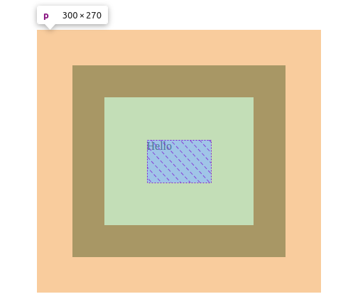

# TABLE OF CONTENTS
- [CSS BOX MODEL](#css-box-model)
  - [Structure of CSS Box Model](#structure-of-css-box-model)
    - [Margin](#margin)
    - [Border](#border)
    - [Padding](#padding)
    - [Content](#content)
  - [Calculating The Total Size of an Element](#calculating-the-total-size-of-an-element)
  - [Additional knowledge](#additional-knowledge)
  - [Conclusion](#conclusion)

<!-- END doctoc generated TOC please keep comment here to allow auto update -->

# CSS BOX MODEL
  CSS box model is a concept in CSS that basically describes the layout of HTML elements to be in box format.    

  Every element is wrapped around in a box.   

  A box can be a square or a rectangle.
## Structure of CSS Box Model
The box is composed of the following components: 
- Margin
- Border
- Padding
- Content


### Margin
A margin is the distance of an element from other elements.   
  
It usually collapses between two elements that are next to each other, and the distance between them becomes the wider margin.  

For instance, if element A and B have a margin of _60px_ and _40px_ respectively, the distance between them will be _60px_.  

It does not contribute to the size of the box element.
### Border
A border is a line that sorrounds the element.  

It contributes to the total size of the box element.
### Padding
Padding is the distance between the border and the main content of the box.  

It defines the background region of an element.  

It also contributes to the total size of the box element.
### Content
This is the main content that is to be displayed on the browser. 

It could be text, an image, a link, or even a video.  

It also contributes to the total size of an element.

## Calculating The Total Size of an Element
In the CSS box model, the total size in terms of width and height, is calculated by adding the margin, padding, and the content size of an element.  
  
Before anything is added to the content, the content normally takes up the entire width of the box.  
   
Upon adding padding and border to the content, the width becomes padding and border size larger.  
     
Let's consider the following HTML example: 

HTML:
```html 
    <p>Hello</p>
```

CSS:

```css
    p {
      padding: 60px;
      width: 90px;
      height: 60px;
      border: 45px solid black;
      margin: 50px;
    }
```

When you inspect the element on the browser, the actual height is as follows:



The total height and width are seen to be ```300px``` and ```270px``` respectively. 

This is calculates as below:
```
  Total height = border top + padding top + content height + padding bottom + border bottom
               = 45 + 60 + 60 + 60 + 45
               = 270
```
```
  Total width = border left + padding left + content width + padding right + border right
               = 45 + 60 + 90 + 60 + 45
               = 300
```
## Additional knowledge
In order to alter the above described behavior, you shouls include the box sizing property to the element.  

```box-sizing: boerder-box;```

This ensures that,the padding and the border of an element are included in its defined width and height.  

For instance, when we add the ```box-sizing``` property to the previously example,the width and height in the browser will be *90px* and *60px* respectively.  

This is because the 

## Conclusion
To sum up, it is important to get a grasp of this model, because it defines the size and layout of elements in the browser.  

In order to have consistent backgrounds, the padding should be well well defined with respect to both the content size and the border size.